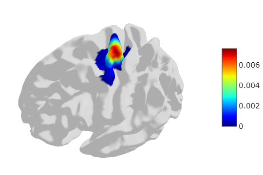

# Population-based probability map and connectional profiles of the hand motor hotspot in transcranial magnetic stimulation 
Here you may find the result of hand motor hotspot (hMHS) for our article on [Population-based probability map and connectional profiles of the hand motor hotspot in transcranial magnetic stimulation](). All resources are provided as complementary to the following article:

## hMHS probability map
The hMHS probability map is one of our main result and can be applied in practice clinical setting. We place the hMHS probability files in [hs_prob_maps](./hs_prob_maps/) and is illustrated as follow. 



## hMHS frequency map in different radius
The parameter `radius` affect the counts of subjects in the frequency map, so we plot the hMHS frequency map with different `radius`. The corresponding frequency maps in `fsaverageLR32k` are stored in [hs_freq_maps](./hs_freq_maps/).


## hMHS deterministic map range in probability threshold
For clinical application, we provide a series of deterministic hMHS maps in different probability threshold. Our article describes the cover rate, areas, volumes, Euclidean distance and surface distance of different probability threshold. So a deterministic hMHS map can be selected by fully comparsion in clinical setting. The following figure shows the deterministic hMHS in different probability threshold. 

And the deterministic hMHS maps in `fsaverage32k` and `MNI152` template space are saved in [hs_desc_maps/fsaverage32k](./hs_desc_maps/fsaverage32k/) and [hs_desc_maps/MNI152](./hs_desc_maps/MNI152/), respectively. These population-based hMHS map can be warpped into native to acquire the individualized hMHS for TMS treatment.

## A simple tool for hMHS individualization
There is a simple [python scripts](./code/hMHS_individualize.py) for hMHS individualize. This scripts uses the ANTs tool to map the population-based hMHS toward native hMHS. 

Here is an example:
```shell
# Only providing the t1 image. The t1 MRI firstly acts as the reference image for registration from MNI152 to Native space. The default hMHS map is set by 'hs_desc_maps/MNI152/hs_map_prob-0.70.nii.gz'. The default output directory is the work directory.
cd code
python hMHS_individualize.py \
    --subj_t1 $t1w_path
```

# Connectivity profile 
We also computed the functional and structural connectivity of hMHS in both voxels level and brain areas level. The coresponding files are stored in [connectivity_profile](./connectivity_profile/).
## Functional connectiviey
As for funcitonal connectivity, the [zmap](./connectivity_profile/fc/) file save the independent one sample t-test result about functional connectivity in a cohort of subjects. The [fc_neg_log_pval.nii.gz](./connectivity_profile/fc/) is the tested p-value file with Bofferoni correction. 

In addition, the brain areas level connectivty files are saved in [fc_conn_brain_areas.csv](./connectivity_profile/fc/). The description of columns are listed as follow:
| Column name         | Description     |
|--------------|-----------|
| BNA ID | The ID encoded in Brainnetome atlas (BNA)    |
| area name     | The brain area name defined in BNA |
| all count | The number of voxels in every brain area of BNA |
| count | The number of functionally significant voxels in every brain area |
| z value| The mean z value of functionally significant voxels in every brain area |
| rate | The ratio of `count` to `all count` |

## Structural connectivity 
Similarly, the sturctural connectivity files are saved in [sc_directory](./connectivity_profile/sc/). The coefficient of variation (CoV) without threshold is saved in [sc_cov.nii.gz](./connectivity_profile/sc/sc_cov.nii.gz). 

And the sturctural connectivity file at brain areas level is saved in 